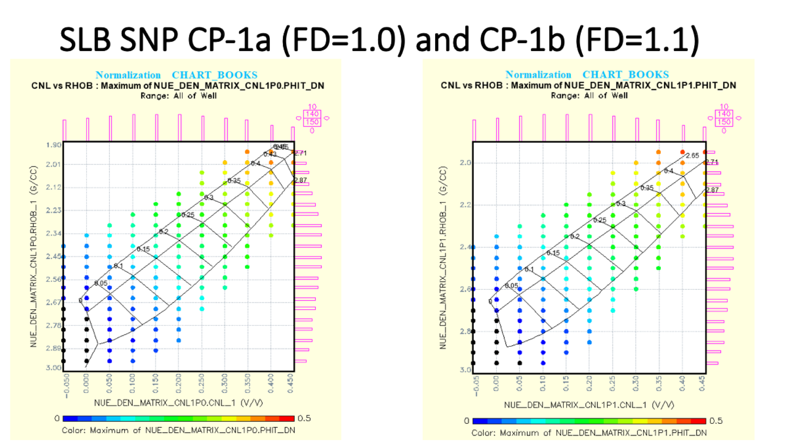

# Chart-Book_Neutron-Density_Porosity-using-KNN
The objective of this project is to calculate a Neutron-Density log analysis based total porosity from Schlumberger CNL or TNPH with fresh and saline Fluid Densities.

The program used is named NeutDen_chartbook_porosity_knn_testresults.py. This program uses a matrix of Neutron Porosity and Bulk Density with known porosities as the training set. We first normalize the Neutron Porosity and Bulk Density and then use a KNN of 3 to estimate Porosity from our test data set. 

 
